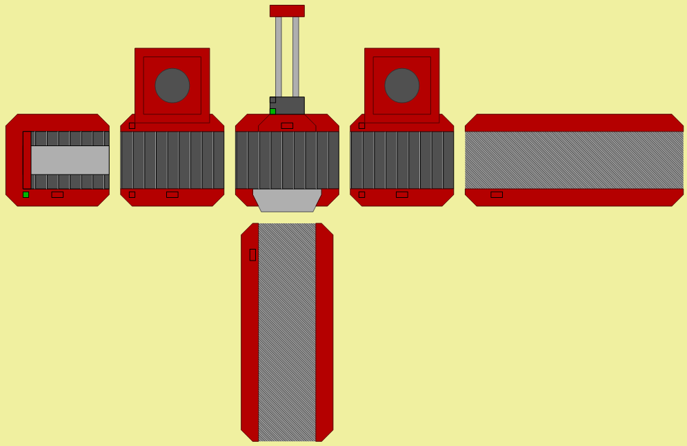

# Supervisory

Implements local supervisory control using modular supervisory systems designed in and exported from [DESTool](https://fgdes.tf.fau.de/destool/index.html) and uses Modbus TCP to control a production line model simulated in [FlexFact](https://www.fgdes.tf.fau.de/flexfact.html). Made for an assignment in a Discrete Event Systems class at [UFRGS](http://www.ufrgs.br/ufrgs/inicial).

# Example

The example folder contains the production line model and supervisors created as part of the original assignment and used to demonstrate des-supervisory. The production lines works by selecting one of two items using buttons 1 and 2 in the FlexFact operator panel. One item goes through one process and exits the first slide after being pushed, while the second item goes through both machines and exits the second slide.



## Contents

The example folder includes the files:

- Line.ffs: the production line model file, to be opened and simulated in FlexFact.
- Controller.pro: the DESTool file used to create the supervisory automata. Can be used to control the plant using DESTool directly.
- ModbusTCPConfig.dev: the Modbus TCP config file generated by FlexFact. Contains connection details and the relations between Modbus coils and generated events.
- H1.gen through H7.gen: the seven modular supervisors made in order to control the production line. Each file contains the state, alphabet and transition table, among other information needed to implement the supervisor automaton.

## Setup

First, start the simulation through FlexFact:

1. Importing the production line (Line.ffs).
1. Enabling Modbus connections (Simulation → Modbus).
1. Starting the simulation (Start).

Then, enable the controller by running des-supervisory:

1. (OPTIONAL) Create an isolated environent (e.g. using venv).
1. Install the required dependencies (```pip install -r requirements.txt```).
1. Run one the following list of commands to execute the main script:
- On Windows (using PowerShell):
```powershell
cd example
python ..\src\main.py ModbusTCPConfig.dev $(gci -Filter H*.gen)
```
- On Linux:
```bash
cd example
python ../src/main.py ModbusTCPConfig.dev H*.gen
```

If the connection is successful, a message stating the control loop has started should appear after a few seconds.

Different lines can be controlled by replacing the ModbusTCPConfig file and the supervisor specification files (H1.gen through H7.gen).